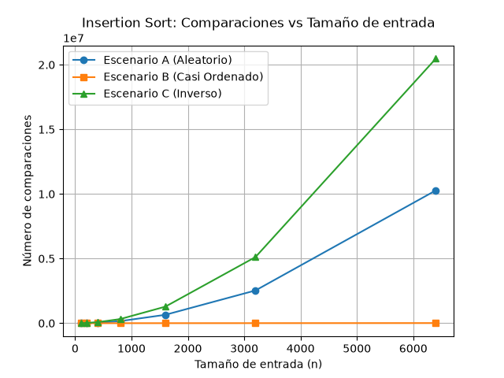
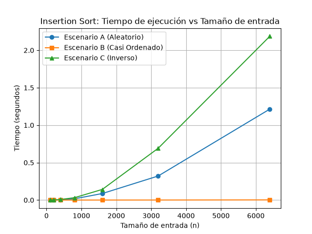
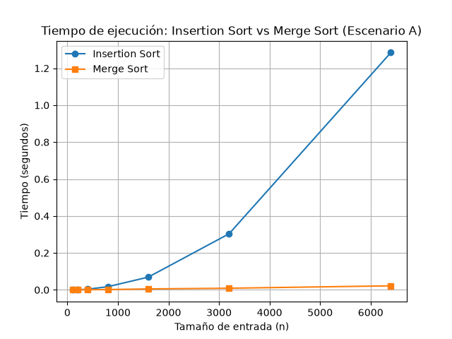

# Laboratorio 1: Fundamentos, complejidad y recurrencias

**Estudiante:** Julian Esteban Suarez Gallego

## Instrucciones de reproducción
1. Activar el entorno virtual: `.\.venv\Scripts\Activate.ps1` (en Windows)
2. Instalar dependencias: `pip install -r requirements.txt`
3. Para generar las gráficas de la parte 3: `python lab1-fundamentos-complejidad-recurrencias/parte3_casos.py`
4. Para generar las gráficas de la parte 4: `python lab1-fundamentos-complejidad-recurrencias/parte4_complejidad.py`

## Parte 1 — Analizar el algoritmo antes de comprar hardware

La diferencia fundamental entre corrección y eficiencia radica en que un algoritmo correcto entrega el resultado esperado (en este caso, la lista ordenada de pacientes por riesgo de mayor a menor), mientras que un algoritmo eficiente logra ese resultado sin agotar los recursos disponibles, como el tiempo o la memoria. En Tamiza, `insertion sort` es un algoritmo correcto porque efectivamente ordena los registros, pero carece de la eficiencia necesaria para respetar la restricción temporal: una ventana estricta de cuatro horas (2:00 a. m. a 6:00 a. m.).

Duplicar la velocidad del servidor no es la solución de fondo. El algoritmo de inserción tiene una complejidad de crecimiento cuadrático en su peor caso ($O(n^2)$). Al aumentar drásticamente el volumen de datos (de 20,000 a 1,200,000 registros), el tiempo de procesamiento se dispara geométricamente. Una mejora lineal en hardware (doble velocidad) será insuficiente ante un crecimiento cuadrático en la cantidad de operaciones. A medida que sigan ingresando más datos, el hardware más potente volverá a quedarse corto muy pronto. 

Un ejemplo adicional donde la corrección no implica viabilidad es un sistema de detección de fraudes en tiempo real para tarjetas de crédito. Supongamos que procesa unas 5,000 transacciones por segundo. Si el algoritmo de clasificación es exhaustivo pero tarda 5 segundos en aprobar o rechazar cada transacción, el resultado puede ser impecable, pero incumple la restricción de latencia máxima (debe ser menor a 1 segundo para no afectar la experiencia del usuario o el punto de venta), lo que lo vuelve inviable en producción.

## Parte 2 — Responsabilidad ambiental y ética de la implementación

### Dimensión ambiental
El tiempo de ejecución de un programa está intrínsecamente ligado al uso prolongado de CPU, memoria y enfriamiento del servidor, lo que se traduce directamente en consumo de energía eléctrica. Ejecutar un algoritmo ineficiente como $O(n^2)$ con 1,200,000 registros mantendrá el servidor operando a máxima capacidad durante horas. A lo largo de meses y años, estas madrugadas de procesamiento ineficiente se acumulan, generando una huella de carbono enorme e innecesaria que podría evitarse optimizando el software.

### Dimensión ética
El fallo por lentitud en este caso perjudica directamente a personas concretas:
1. **Pacientes de alto riesgo no priorizados:** Si el ordenamiento no termina y se usa una lista desordenada, pacientes en estado crítico no recibirán su cita a tiempo. El costo (deterioro de su salud o la vida) es asumido injustamente por el paciente.
2. **Operadores de llamadas:** Se enfrentan a llamadas de personas de bajo riesgo sin necesidad inmediata, y peor aún, pueden recibir reclamos de pacientes graves que no fueron llamados antes. El costo psicológico y la sobrecarga laboral recaen sobre ellos y el sistema de salud en general.

La corrección del orden implica más que "ordenar números": significa garantizar una jerarquía ética de atención médica. Dado que las listas deciden turnos y tiempos de intervención, un error o la interrupción prematura del ordenamiento implica negar la prioridad de atención médica a quien más la requiere, vulnerando la equidad del servicio.

## Parte 3 — Peor caso, mejor caso y caso promedio, demostrados en Python

[Código de la Parte 3](parte3_casos.py) | [algoritmos.py](algoritmos.py) | [datos.py](datos.py)

### 3.1 Explicación y predicciones
- **Peor caso:** Es el análisis del costo máximo sobre todas las posibles entradas de tamaño fijo $n$. Nos da una cota superior garantizada.
- **Mejor caso:** Es el análisis del costo mínimo sobre todas las posibles entradas de un tamaño fijo $n$. Ocurre cuando la estructura inicial de los datos favorece inherentemente al algoritmo.
- **Caso promedio:** Es el costo esperado considerando todas las permutaciones posibles de las entradas de tamaño $n$ bajo una distribución de probabilidad.

Para decidir si el algoritmo entra en producción con una ventana estricta de cuatro horas, utilizaría el **peor caso**. Necesitamos garantizar sin falta que el proceso culminará antes de las 6:00 a. m. sin importar qué tipo de lote ingrese o cómo estén mezclados los registros.

**Predicciones para Insertion Sort:**
- **Escenario C (Orden Inverso):** Será el **peor caso**. Como queremos ordenar de mayor a menor y llegan de menor a mayor, cada nuevo elemento a insertar tendrá que compararse y desplazarse a través de toda la parte ya ordenada.
- **Escenario B (Casi Ordenado):** Será el **mejor caso**. El 98% ya viene ordenado correctamente (de mayor a menor), provocando solo 1 comparación por cada uno de estos elementos. El restante 2% ocasionará movimientos menores pero será el más eficiente.
- **Escenario A (Aleatorio):** Representará el **caso promedio**.

### 3.2 Análisis de resultados




Como se observa en las gráficas, el Escenario C se destaca claramente como el de mayor costo tanto en número de comparaciones como en tiempo de ejecución, ratificando mi predicción de que es el peor caso para insertion sort. El Escenario B se mantiene con costos operacionales mínimos (prácticamente lineal en la gráfica de tiempo en la parte inferior), siendo efectivamente el mejor caso debido a su pre-ordenamiento inicial de un 98%. El Escenario A se sitúa en un punto intermedio, modelando el caso promedio esperado.

## Parte 4 — Complejidad de merge sort e insertion sort: cálculo y validación

[Código de la Parte 4](parte4_complejidad.py)

### 4.1 Cálculo teórico

**Planteamiento de la recurrencia de Merge Sort:**
$$T(n) = 2T(n/2) + \Theta(n)$$
- **$2$:** Número de subproblemas. El arreglo se divide en dos mitades exactamente iguales o casi iguales.
- **$T(n/2)$:** El tamaño de cada subproblema. Cada mitad contiene $n/2$ elementos que deben ordenarse recursivamente.
- **$\Theta(n)$:** El costo de combinar las dos partes ya ordenadas. Intercalar las dos mitades toma un tiempo proporcional a la cantidad total de elementos $n$.

**Solución por Método Maestro:**
La recurrencia es de la forma $T(n) = aT(n/b) + f(n)$.
- $a = 2$
- $b = 2$
- $f(n) = \Theta(n)$

Calculamos $n^{\log_b a} = n^{\log_2 2} = n^1 = n$.
Comparamos $f(n)$ con $n^{\log_b a}$:
$f(n) = \Theta(n) = \Theta(n^{\log_b a})$.
Esto corresponde al **Caso 2** del Teorema Maestro.
Por lo tanto, la cota final es: $T(n) = \Theta(n \log n)$.

**Cálculo línea a línea de Insertion Sort:**

```python
def insertion_sort(datos):
    arr = datos.copy()           # c1: 1 vez
    comparaciones = 0            # c2: 1 vez
    n = len(arr)                 # c3: 1 vez
    for i in range(1, n):        # c4: n veces
        key = arr[i]             # c5: n - 1 veces
        j = i - 1                # c6: n - 1 veces
        while j >= 0:            # c7: sum_{i=1}^{n-1} t_i veces
            comparaciones += 1   # c8: sum_{i=1}^{n-1} (t_i - 1) veces
            if arr[j] < key:     # c9: sum_{i=1}^{n-1} (t_i - 1) veces
                arr[j + 1] = arr[j] # c10: sum_{i=1}^{n-1} (t_i - 1) veces
                j -= 1           # c11: sum_{i=1}^{n-1} (t_i - 1) veces
            else:
                break            # c12: sum_{i=1}^{n-1} 1 vez (en caso promedio/peor)
        arr[j + 1] = key         # c13: n - 1 veces
```
En el peor caso (arreglo en orden inverso), el `while` recorre hacia atrás todos los elementos anteriores, por lo que $t_i = i + 1$. La suma $\sum_{i=1}^{n-1} i$ da como resultado un polinomio de grado 2, por lo que el tiempo de ejecución crece cuadráticamente: $O(n^2)$.

**Tabla de complejidades:**

| Algoritmo | Mejor caso | Peor caso | Caso promedio |
|-----------|------------|-----------|---------------|
| Insertion Sort | $O(n)$ | $O(n^2)$ | $O(n^2)$ |
| Merge Sort | $O(n \log n)$ | $O(n \log n)$ | $O(n \log n)$ |

### 4.2 Validación experimental



A medida que crece el tamaño de entrada $n$, la curva de `insertion sort` toma una forma claramente parabólica ascendente, confirmando su comportamiento cuadrático. Por su parte, la curva de `merge sort` se mantiene muy plana en comparación, demostrando su eficiencia logarítmica-lineal y absorbiendo fácilmente incrementos en la carga de datos sin penalizar fuertemente el tiempo.
Se recomienda a Tamiza implementar Merge Sort ya que en grandes cantidades de registros superará ampliamente la capacidad de Insertion Sort, estabilizando el tiempo de ejecución en $O(n \log n)$.

Esta conclusión experimental coincide a la perfección con la teoría calculada en 4.1.

### 4.3 Concepto técnico a la Secretaría de Salud

Estimado equipo de ingeniería de la Secretaría de Salud:

En respuesta a su consulta técnica para remediar los recientes incumplimientos en la ventana de tiempo del programa de tamizaje cardiovascular, les presentamos el diagnóstico y nuestra recomendación de diseño. 

Tras analizar a fondo la propuesta de duplicar la velocidad del procesador del servidor, se determinó que esta medida no solucionará el problema. El verdadero cuello de botella es la naturaleza del algoritmo `insertion sort` que funciona actualmente. Como se demostró experimentalmente, su tiempo de ejecución crece cuadráticamente con respecto a la cantidad de datos (para una entrada aleatoria de $N=6400$, tardó considerablemente más, con un trazo exponencial de aumento, en la gráfica *Tiempo de ejecución: Insertion Sort vs Merge Sort*). Duplicar el hardware recortaría los tiempos a la mitad de forma temporal, pero dada una carga de 1.200.000 pacientes, un algoritmo cuadrático seguirá desbordando la ventana de cuatro horas. Según estimaciones, 1.200.000 registros para Insertion Sort bajo condiciones aleatorias podrían tomar más de varios días de procesamiento ininterrumpido (extrapolando de los tiempos a escala pequeña). 

**Nuestra recomendación** es sustituir definitivamente la implementación por **Merge Sort**. Este algoritmo ordena basándose en una estrategia de dividir y conquistar, lo que estabiliza matemáticamente el tiempo de ejecución a $\Theta(n \log n)$, independientemente de cómo lleguen pre-ordenados los datos (escenarios aleatorio, inverso o casi ordenado). Extrapolando este desempeño, la carga de los 1.200.000 registros tardaría un estimado de pocos segundos o como máximo un par de minutos en Merge Sort, asegurando cómodamente que los resultados estén listos antes de las 6:00 a. m.

Como única consideración de diseño, cabe mencionar que Merge Sort consumirá memoria auxiliar adicional para intercalar los datos. Sin embargo, para 1.200.000 registros de enteros y datos elementales, la memoria en servidores modernos superará este requisito (unos pocos megabytes en memoria RAM), siendo un costo marginal que justifica plenamente la ganancia drástica en tiempo, salvaguardando nuestra responsabilidad ética frente a la correcta priorización de pacientes críticos de manera puntual todos los días.

