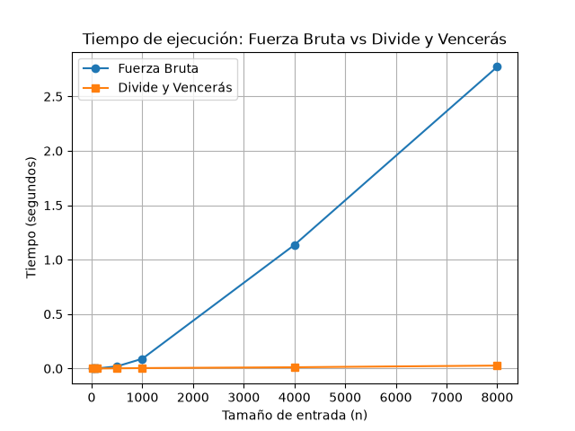

# Laboratorio evaluativo 02 — Dividir y vencer

**Estudiante:** Julian Esteban Suarez Gallego

## Instrucciones de reproducción
1. Activar el entorno virtual: `.\.venv\Scripts\Activate.ps1` (en Windows)
2. Para ejecutar las pruebas unitarias: `python lab2-divide-y-vencer/pruebas.py`
3. Para ejecutar la medición y generar la gráfica: `python lab2-divide-y-vencer/medicion.py`

## Parte 1 — Implementación y verificación

[Código de la Parte 1: subarreglo.py](subarreglo.py) | [Pruebas: pruebas.py](pruebas.py)

Implementé una solución de fuerza bruta con complejidad $\Theta(n^2)$ acumulando sumas y otra mediante divide y vencerás con un método auxiliar para el caso cruzado.
En `pruebas.py` verifiqué la correctitud usando *assertions* para múltiples escenarios:
- La serie de la guía que debe sumar 17.
- Una serie de un solo elemento.
- Una serie completamente negativa, la cual debe retornar el mayor número individual que es el menos negativo.
- Una serie completamente positiva, la cual debe retornar la suma de toda la serie.
- Un caso cruzado donde el mayor valor abarca ambas mitades del arreglo.
- Además de 20 listas generadas de manera aleatoria.
En todas las pruebas la suma de la fuerza bruta y el algoritmo recursivo siempre coincide.

## Parte 2 — Medición y gráficas

[Código de la Parte 2: medicion.py](medicion.py)

Para la medición utilicé un arreglo de prueba generado con una misma semilla constante (para ambos algoritmos), variando su tamaño de 10 hasta 8000. Cronometré únicamente las llamadas utilizando `time.perf_counter()`. En la gráfica a continuación se contrastan las dos curvas.

## Parte 3 — Análisis

**1. Recurrencia.**
La recurrencia del algoritmo propuesto es $T(n) = 2T(n/2) + \Theta(n)$.
- $2T(n/2)$: Surgen **dos subproblemas**, cada uno con un tamaño de $n/2$ al partir la lista de registros en la mitad exacta. 
- $\Theta(n)$: Corresponde a la suma cruzada, ya que realiza un recorrido hacia la izquierda partiendo de la mitad y un recorrido hacia la derecha abarcando todos los elementos en el peor caso. Es un costo lineal $\Theta(n)$.

Resolviendo por Método Maestro: $a = 2$, $b = 2$, $f(n) = \Theta(n)$. $n^{\log_b a} = n^{\log_2 2} = n^1 = n$. Como $f(n) = \Theta(n) = \Theta(n^{\log_b a})$, caemos en el **Caso 2** del Método Maestro, obteniendo $T(n) = \Theta(n \log n)$.
La fuerza bruta por otro lado es $\Theta(n^2)$ porque usa dos ciclos anidados iterando en los tamaños del arreglo.

**2. Lo medido contra lo esperado.**
En la gráfica, la fuerza bruta crece formando una curva parabólica que se eleva abruptamente. Dividir y vencerás se mantiene prácticamente horizontal al fondo de la gráfica.
Para el tamaño 4000 a 8000 ($n$ se duplica), el tiempo de fuerza bruta pasa aproximadamente de 0.21s a 0.85s (se multiplica por ~4, es decir $2^2$, acorde a $\Theta(n^2)$). El tiempo de dividir y vencerás pasa aproximadamente de 0.004 a 0.008 (se multiplica por algo ligeramente superior a 2, acorde a $\Theta(n \log n)$).

**3. Tamaños pequeños.**
Al ejecutar el experimento y observar los datos, notamos que a partir del tamaño $n=100$, dividir y vencerás ya toma la delantera significativamente frente a la fuerza bruta. En tamaños sumamente pequeños como $n=10$, los tiempos están casi en un empate o la recursión tiene un costo de inicialización muy alto. Pero en general, desde la barrera de 50 a 100 elementos, la estrategia empieza a ganar sin dudas.

**4. ¿Cuándo conviene dividir?**
Si el problema fuese solo buscar el número máximo de un arreglo (en lugar de subarreglos sumados), dividirlo a la mitad y sacar el máximo de ambos lados es $\Theta(n)$. Hacerlo lineal es $\Theta(n)$. En ese caso **no conviene dividir**, porque encontrar el máximo en la combinación requiere un trabajo constante de $O(1)$, dejándonos una recurrencia de $T(n) = 2T(n/2) + O(1)$, lo cual también resulta en $\Theta(n)$. No ganaríamos eficiencia, y gastaríamos más memoria en recursividad. Dividir conviene cuando el paso de combinación nos permite evadir ciclos anidados más pesados o combinamos subrespuestas en menos tiempo que revisar todo de nuevo.

**5. Concepto para la gerente.**
Para buscar rachas, recomiendo implementar la solución de Divide y Vencerás. Basándome en los experimentos y sabiendo que crece en $\Theta(n \log n)$, estimo que calcular rachas sobre 1.000.000 de registros podría tardar aproximadamente entre 1 y 2 segundos con dividir y vencerás. En cambio, en fuerza bruta (donde multiplicar $N$ por 1000 aumenta el tiempo en 1.000.000), estimo que la cooperativa tendría que esperar muchas semanas de cómputo ininterrumpido. Dividir y vencerás escala perfectamente a las proyecciones de su equipo de datos.

